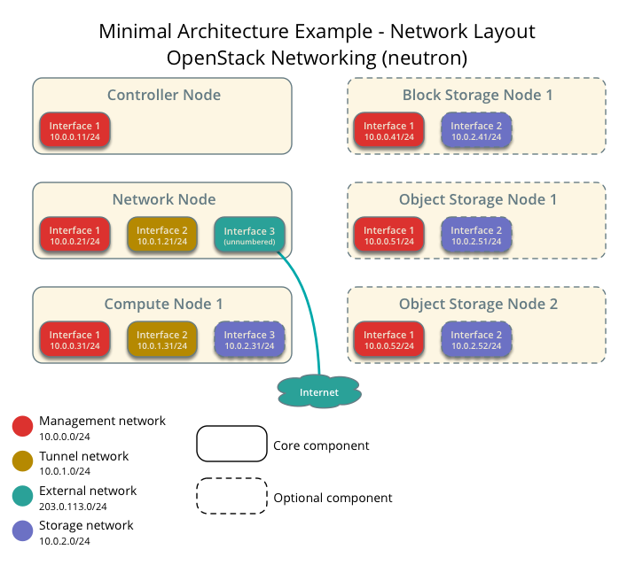
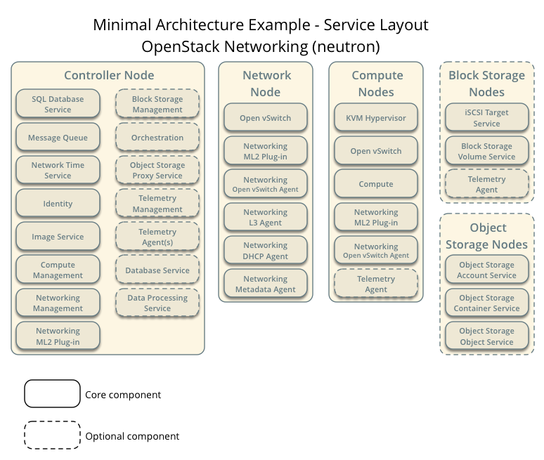

instalar OpenStack con la arquitectura de nodos (neutron)
==============================================================

Vamos a colocar las siguientes imagenes que son importante tenerlas presente. Si las entiendes significa que todo se le hara muy facil, si no las entiende es mejor que se detenga y las analice bien.

Arquitectura minima de ejemplo con legacy networking (neutron)— Hardware requirements

.. figure:: ../images/neutron/Minimal_architecture_Neutron.png

Arquitectura minima de ejemplo con legacy networking (neutron)— Capa de Red

Arquitectura minima de ejemplo con legacy networking (neutron)— Capa de Servicio

Ya teniendo claro esta infraestructura vamos a encender las dos maquinas virtuales y nos conectarnos a ellas con ssh, recuerde descargar el proyecto::

	$ git clone https://github.com/cgomeznt/openstack.git

para que copie los script en los servidores, tambien puede ir abriendo cada script copiar el contenido y luego crear el script en los servidores. (utilice la tecnica que usted prefiera) 

Continuamos trabajando...!!!
