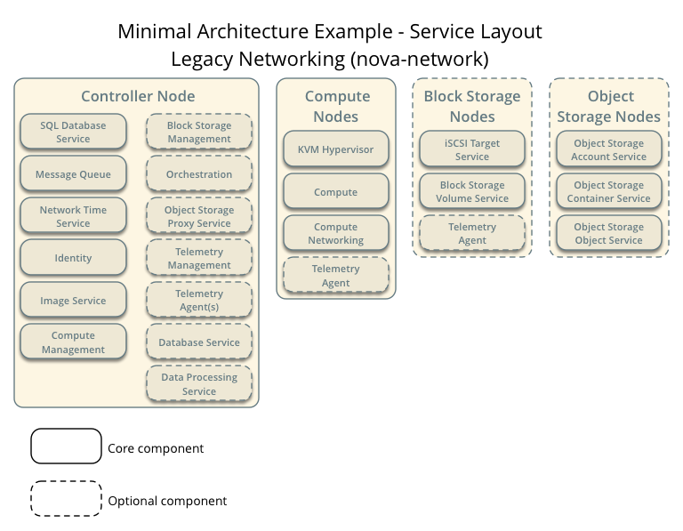
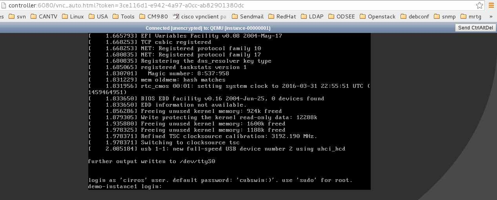
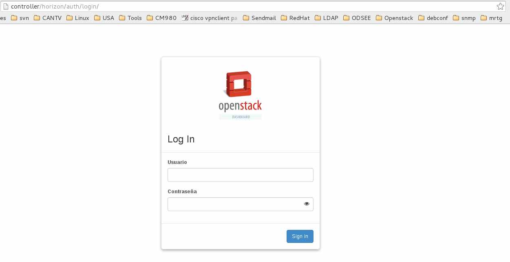
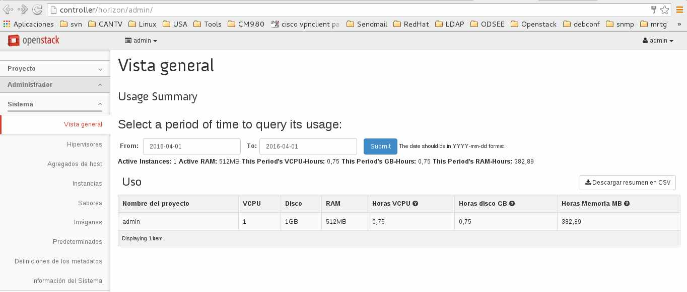

instalar OpenStack con la arquitectura de nodos (nova-network)
==============================================================

Vamos a colocar las siguientes imágenes que son importante tenerlas presente. Si las entiendes significa que todo se le hará muy fácil, si no las entiende es mejor que se detenga y las analice bien.

Arquitectura mínima de ejemplo con legacy networking (nova-network)— Requerimientos Hardware
+++++++++++++++++++++++++++++++++++++++++++++++++++++++++++++++++++++++++++++++++++++++++++

.. figure:: ../images/nova/Minimal_architecture_nova-network.png

Arquitectura mínima de ejemplo con legacy networking (nova-network)— Capa de Red
+++++++++++++++++++++++++++++++++++++++++++++++++++++++++++++++++++++++++++++++++++++++++++

.. figure:: ../images/nova/Minimal_architecture_nova-network_1.png

Arquitectura mínima de ejemplo con legacy networking (nova-network)— Capa de Servicio
+++++++++++++++++++++++++++++++++++++++++++++++++++++++++++++++++++++++++++++++++++++++++++

Ya teniendo claro esta infraestructura vamos a encender las dos maquinas virtuales y nos conectarnos a ellas con ssh, recuerde descargar el proyecto::

	$ git clone https://github.com/cgomeznt/openstack.git

para que copie los script en los servidores, tambien puede ir abriendo cada script copiar el contenido y luego crear el script en los servidores. (utilice la tecnica que usted prefiera) 

Iniciamos las dos (2) maquinas virtuales creadas con virtualbox. Recuerden que solo le instalamos  Ubuntu con openssh-server y git, las tarjetas de redes no estan configuradas porque mas adelante lo haremos.

Iniciamos en cada una de ellas y vemos cual es la dirección ip que obtuvieron en el eth2 la cual esta configurada en el `adaptador de puente <maquinasvirtuales.rst>`_, esto lo hacemos para poder conectarnos por medio de ssh desde el Host hacia ellas. Recuerde que en este adaptador usted tiene conexión hacia el internet (Tomando en cuenta que usted ya tiene conexión a internet con su Host).

Por lo normal siempre la gente tiene problemas con la configuración del route y de los DNS, por eso vamos a realizar primero unas pruebas en los servidores. Imaginemos que en el eth2 que esta por el `adaptador de puente <maquinasvirtuales.rst>`_ entrega IP del segmento 192.168.1.0/24 y que el default gateway debe ser 192.168.1.1 y los DNS deberia ser 192.168.1.1 si este cumple este papel, sino podemos colocar los DNS de google 8.8.8.8, `vamos a verificar <verificargwdns.rst>`_

Copiar el proyecto en cada una de ellas con la técnica que usted prefiera, puede hacerlo con git en cada una de ellas::

	$ git clone https://github.com/cgomeznt/openstack.git

De ahora en adelante, vamos a llamar a los servidores nodo controller y nodo compute1. también se dará cuenta que los scripts le estará dando recomendaciones.

Comencemos con el que sera nodo controller

nodo controller
++++++++++++++++++
::

# sudo su

::

# cd openstack/scripts/

::

# . openstack-inicio.sh

Debe reiniciar el equipo y siempre recuerde hacer ``sudo su`` y cd openstack/scripts/
::

# . openstack-security.sh

::

# . openstack-networking.sh 

Edite el archivo /etc/network/interfaces y configure la eth0 para que quede como en la guía de OpenStack::

	# vi /etc/network/interfaces
		auto eth0
		iface eth0 inet static
		address 10.0.0.11
		netmask 255.255.255.0

::

	# ifdown eth0 && ifup eth0 && ifconfig eth0
		eth0  Link encap:Ethernet  HWaddr 08:00:27:8b:e8:0b  
		      inet addr:10.0.0.11  Bcast:10.0.0.255  Mask:255.255.255.0
		      inet6 addr: fe80:a00:27ff:fe8b:e80b/64 Scope:Link
		      UP BROADCAST RUNNING MULTICAST  MTU:1500  Metric:1
		      RX packets:35 errors:0 dropped:0 overruns:0 frame:0
		      TX packets:61 errors:0 dropped:0 overruns:0 carrier:0
		      collisions:0 txqueuelen:1000 
		      RX bytes:11970 (11.9 KB)  TX bytes:18522 (18.5 KB)

Luego que configure la ip 10.0.0.11 en le eth0 continué con::

# . openstack-network-test.sh 

Es lógico que el nodo compute1 no responda porque aun no lo hemos configurado y el nodo network porque no lo utilizaremos, pero controller y openstack.org si deben responder. `si falla verificar gateway o DNS <verificargwdns.rst>`_
::

# openstack-server-test.sh

::

# . openstack-ntp.sh

::

# . openstack-packages.sh

Debes reiniciar el equipo y siempre recuerde hacer ``sudo su`` y cd openstack/scripts/luego de reiniciar siempre, también debe verificar la conexión de red y el NTP

Mucho cuidado con la clave que le va pedir, deber recordarla porque esa clave es del manejador de base de datos MariaDB. Luego el te pedirá que coloques el password de root (recuerda es del manejador de base de datos MariaDB) cuando te pregunte si quieres cambiar el password le dice que NO y al resto de las opciones le dice que Yes. Cuando te pregunte nuevamente por la clave de root (recuerda es del manejador de base de datos MariaDB) se la suministras. No deje de hacer las pruebas que te indica el script
::

# . openstack-database.sh

::

# . openstack-rabbitmq.sh

Realice las pruebas que le indica el script. Se crearon dos archivos en python (send.py y recived.py) que son muy útiles para resolver fallas con rabbitMQ-server, para darle una idea puede ejecutar recived.py en el controller para que se quede escuchando todas las peticiones y desde su equipo Host puede ejecutar send.py (claro en send.py debe editarlo y donde dice controller colocar la IP del controller y en "credentials = pika.PlainCredentials('guest', 'AQUI VA LA CLAVE')", recuerde que las claves esta en "cat password-table.sh". Si llegara a fallar reinicie el servicio de rabbitMQ-server
::

# /etc/init.d/rabbitmq-server restart

Vamos a continuar
::

# . openstack-keystone.sh

::

# . openstack-glance.sh

::

# . openstack-nova-controller.sh

::

# . openstack-nova-network.sh

Debemos copiarnos el archivo que contiene los password al nodo compute1
::

# scp password-table.sh usuario@compute1:/tmp

Ahora debemos pasar al nodo compute1.

nodo compute1
++++++++++++++++++
::

# sudo su

::

# cd openstack/scripts/

::

# openstack-inicio.sh

Debe reiniciar el equipo y siempre recuerde hacer ``sudo su`` y cd openstack/scripts/
::

# openstack-networking.sh

Edite el archivo /etc/network/interfaces y configure la eth0 y la eth1 para que quede como en la guía de OpenStack, pero antes capturen con ifconfig eth1 que IP tiene porque luego la utilizaremos::

	# vi /etc/network/interfaces
		auto eth0
		iface eth0 inet static
		address 10.0.0.31
		netmask 255.255.255.0

		auto eth1
		iface eth1 inet manual
		  up ip link set dev $IFACE up
		  down ip link set dev $IFACE down

::

	# ifdown eth0 && ifup eth0 && ifconfig eth0
		eth0  Link encap:Ethernet  HWaddr 08:00:27:8b:e9:1b  
		      inet addr:10.0.0.31  Bcast:10.0.0.255  Mask:255.255.255.0
		      inet6 addr: fe80:a00:28ff:fe8b:e90b/64 Scope:Link
		      UP BROADCAST RUNNING MULTICAST  MTU:1500  Metric:1
		      RX packets:35 errors:0 dropped:0 overruns:0 frame:0
		      TX packets:61 errors:0 dropped:0 overruns:0 carrier:0
		      collisions:0 txqueuelen:1000 
		      RX bytes:11970 (11.9 KB)  TX bytes:18522 (18.5 KB)

Lo siguiente debería funcionar pero aun no descubro porque falla, por lo tanto y muy mala practica reinicio el nodo compute1 (no libera la IP de eth1)
::

	# ifdown eth1 && ifup eth1 && ifconfig eth1

Luego que configure la ip 10.0.0.31 en le eth0 y la eth1 la colocamos en manual, continué con::

# openstack-network-test.sh

El nodo network no responde porque no lo utilizaremos, pero controller, compute1 y openstack.org si deben responder. `si falla verificar gateway o DNS <verificargwdns.rst>`_
::

# openstack-server-test.sh

::

# openstack-ntp.sh

::

# openstack-packages.sh

Debes reiniciar el equipo y siempre recuerde hacer ``sudo su`` y cd openstack/scripts/luego de reiniciar siempre, también debe verificar la conexión de red y el NTP
::

Recuerdan el archivo password-table.sh que copiamos del nodo controller a compute1, pues ahora debemos colocarlo en la ruta en doden se encuentran todos los scripts
::

# mv /tmp/password-table.sh .

Ahora si podemos instalar los paquetes de nova-compute
::

# openstack-nova-compute.sh

Vamos un momento al nodo controller para verificar que todo marche bien y que ya este viendo al nodo compute1, les recuerdo, cuidado con las claves que se utilizaron en /etc/nova/nova.conf siempre hay errores con eso y pendiente con rabbitMQ-server
::

 # source admin-openrc.sh && nova service-list

Regresamos al nodo compute1 para ejecutar
::

# openstack-nova-network.sh

Listo, vamos al nodo controller a  crear una infraestructura de red virtual, recuerden que en el nodo compute1 la interface eth1 la configuramos como manual y que se les había dicho que guardaran la IP que le estaba entregando el DHCP del NAT, imaginen que dio 10.0.3.15 (la adaptan a lo que ustedes le dio)
::

 # source admin-openrc.sh
 # nova network-create demo-net --bridge br100 --multi-host T --fixed-range-v4 10.0.3.20/29
 # nova net-list

Hasta aqui vamos bien y ya podemos crear una instancia dentro de nuestro OpenStack, para emocionarnos un poco y ver que si funciona.

Ejecute el siguiente comando en el nodo controller
::

# openstack-launch-instance.sh

Cuando culmine no deje de hacer lo que le indica el script, bueeee...!!! igual lo colocamos aquí para que no se preste inconvenientes.
En su Host puede editar el archivo  '/etc/hosts' y agregar una linea como la siguiente con la IP que tiene controller
en la eth2, la que esta configurada en el adaptador de puente.
::

	vi /etc/hosts
	192.168.1.11	controller
	192.168.1.21	network
	192.168.1.31	compute1

La URL que capturo o que puede capturar con el siguiente comando
::

nova get-vnc-console demo-instance1 novnc

Luego desde el Host abra un navegador y coloca la URL que capturo, deberá ver algo como la siguiente imagen

Cuando inicie sesión en la instancia ( el usuario es **cirros** y la clave **cubswin:)** ) ejecute un ping a openstack.org y vera que resuelve el DNS pero no responde el ICMP, el siguiente comando que vamos a ejecutar no esta bien, pero lo hacemos solo para enrutar el trafico de las IPs asignadas a las instancias por la eth2 que si tiene salida al Internet, ejecute el siguiente comando en el nodo compute1
::

# iptables -t nat -A POSTROUTING -o eth2 MASQUERADE

Ahora vamos nuevamente a la instancia, detenemos el ping y lo volvemos a iniciar el ping a openstack.org, ahora si hay respuesta.

También puede establecer conexión ssh con la instancia, para eso ejecutamos este comando para obtener la IP de la instancia, pero desde el nodo controller
::

# nova list

Luego nos vamos al nodo compute1 y ejecutamos (con la IP que usted capturo)
::

# ssh cirros@10.0.3.18

Ahora instalemos el dashboard nombre codigo Horizon, esto sera más grafico y ya los administradores se sentirán más cómodos, en el nodo controller.
::

# openstack-horizon.sh

En nuestro Host accedemos al dashboard usando un navegado web http://controller/horizon , vera algo como esto.

Autentique usando las credenciales de admin o demo, para obtener la clave seria en el nodo controller
::

	# awk -F= '/ADMIN/ {print $2}' password-table.sh 
	95cd5b195e855fc0bdbe

Cuidado el codigo generado es aleatorio, no sera igual al que usted tiene.

Hasta aqui vemos que si funciona realmente las guías de `OpenStack <http://docs.openstack.org/kilo/install-guide/install/apt/content/>`_  
vamos muy bien...!!!

Continuamos trabajando...!!!
